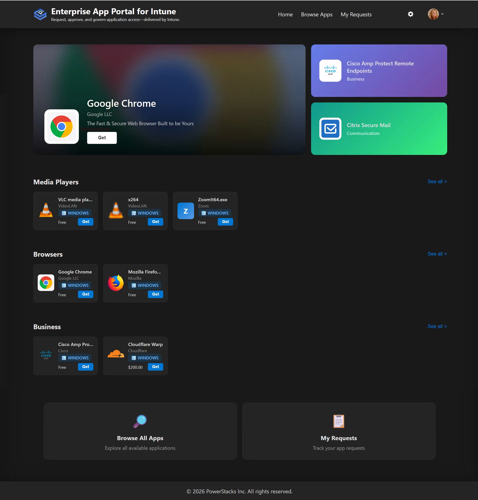
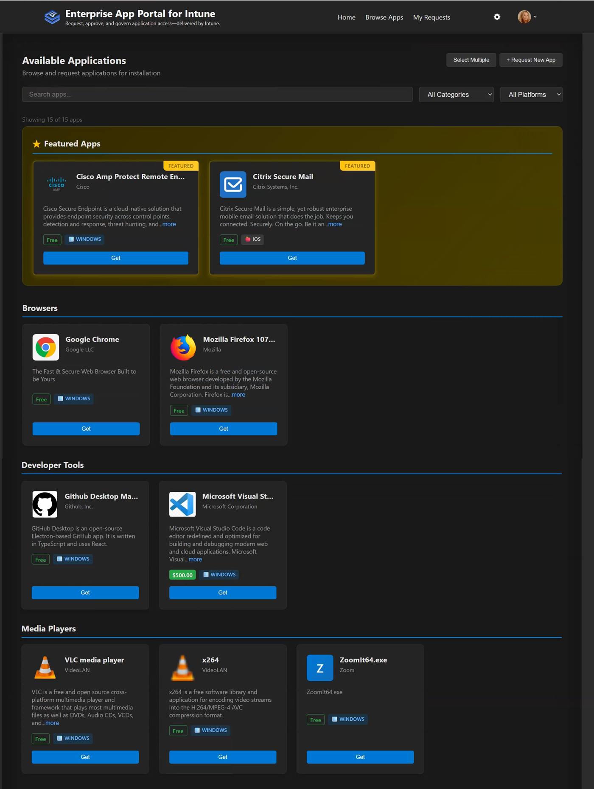
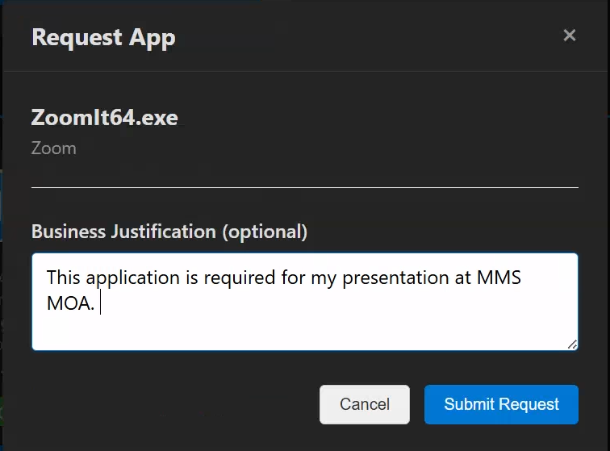
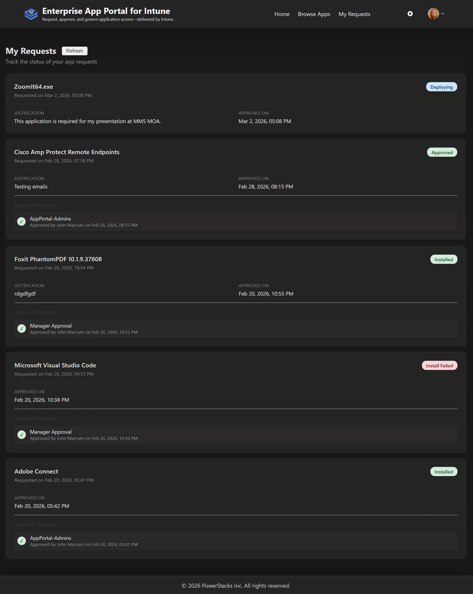
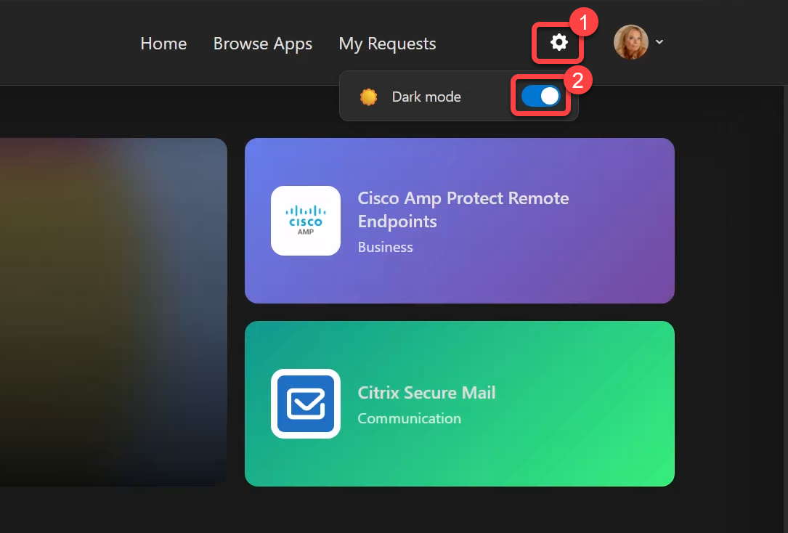

# App Portal for Intune - User Guide

This guide helps employees use the App Portal for Intune to browse, request, and track application installations for their devices.

**Last Updated:** February 2026

---

## Table of Contents

1. [Getting Started](#getting-started)
2. [Browsing Apps](#browsing-apps)
3. [Requesting an App](#requesting-an-app)
4. [Requesting a New App](#requesting-a-new-app)
5. [Tracking Your Requests](#tracking-your-requests)
6. [Install Status](#install-status)
7. [Request on Behalf of Another User](#request-on-behalf-of-another-user)
8. [Settings and Preferences](#settings-and-preferences)
9. [FAQ](#faq)

---

## Getting Started

### Signing In

1. Navigate to your organization's App Portal for Intune URL
2. Click **Sign in with Microsoft**
3. Enter your work email and password
4. Complete any MFA (multi-factor authentication) prompts if required

Once signed in, you'll see the home page with featured apps and categories.

### First-Time Users

On your first visit, you may be asked to:
- Accept the **Terms of Service** (if configured by your admin)
- Review portal features and navigation

---

## Browsing Apps

### Home Page

The home page displays:
- **Hero App**: A featured application highlighted by your admin
- **Featured Apps**: Curated apps recommended for your organization
- **Browse by Category**: Quick links to app categories (Productivity, Development, Communication, etc.)

*The home page showing featured apps and hero app*

### Browse Apps Page

Click **Browse Apps** in the navigation to see all available applications.

*The browse apps page with search and filters*

#### Filtering and Search

- **Search Box**: Type to search by app name, publisher, or description
- **Platform Filter**: Filter by Windows, iOS, Android, macOS, or Web
- **Category Filter**: Filter by app category
- **Show Requested**: Toggle to see only apps you've already requested

#### App Cards

Each app card shows:
- App icon
- App name
- Publisher
- Platform icon (Windows, iOS, Android, etc.)
- Brief description
- Cost estimate (if configured)
- **Request** or **Requested** button

---

## Requesting an App

### Basic Request

1. Find the app you want to install
2. Click the **Request** button on the app card
3. Fill out the request form:
   - **Justification** (required): Explain why you need this app
   - **Device** (for device-targeted apps): Select which device should receive the app
4. Click **Submit Request**

*The app request form with justification field*

### Device Selection

Some apps are deployed to specific devices rather than your user account. For these apps:
- You'll see a **Select Device** dropdown
- Choose from your enrolled Intune-managed devices
- The app will be installed only on the selected device

### Approval Requirements

Apps may have different approval requirements:
- **No Approval Required**: Automatically approved and deployed
- **Manager Approval**: Your direct manager must approve
- **Designated Approver**: A specific person or group must approve
- **Multi-Stage Approval**: Multiple approvers in sequence

You'll see the approval requirements before submitting.

---

## Requesting a New App

If the app you need isn't in the catalog, you can submit a request to have it added.

### How to Request a New App

1. Go to the **Browse Apps** page
2. Click the **+ Request New App** button in the top-right corner
3. Fill out the request form:

| Field | Required | Description |
|-------|----------|-------------|
| **App Name** | Yes | The name of the application you need |
| **Publisher** | No | The company that makes the app (e.g., Microsoft, Adobe) |
| **Why do you need this app?** | No | Your business justification for needing this app |
| **Download URL** | No | A link to where the app can be downloaded |

4. Click **Submit Request**

### What Happens Next

1. Your request is emailed to the IT administrators
2. An administrator reviews your request
3. If approved, they add the app to the portal
4. You'll be able to request the app through the normal process

### Tips for Getting Your Request Approved

- **Be specific**: Include the exact app name and version if known
- **Explain the business need**: How will this app help you do your job?
- **Provide a download link**: If you know where to get the app, include the URL
- **Check first**: Make sure the app isn't already in the catalog under a different name

---

## Tracking Your Requests

### My Requests Page

Click **My Requests** in the navigation to see all your app requests.

*The My Requests page showing request history and status*

#### Request Status

| Status | Meaning |
|--------|---------|
| **Pending** | Waiting for approval |
| **Approved** | Request approved, awaiting deployment |
| **Rejected** | Request denied (see rejection reason) |
| **Completed** | App deployed successfully |
| **Failed** | Installation failed (contact support) |

#### Request Details

Click on any request to see:
- Request date and time
- Current status
- Approval history (who approved/rejected and when)
- Rejection reason (if applicable)
- Installation status

### Email Notifications

You'll receive email notifications when:
- Your request is submitted (confirmation)
- Your request is approved
- Your request is rejected
- Your app is installed (completion)

### Teams Notifications

If configured by your admin, you'll also receive Microsoft Teams direct chat notifications for request updates.

---

## Install Status

After your request is approved, you can track the installation progress.

### Install Status Indicators

| Status | Meaning |
|--------|---------|
| **Pending Install** | Deployment queued, waiting for device sync |
| **Installing** | Installation in progress |
| **Installed** | App successfully installed |
| **Install Failed** | Installation encountered an error |
| **Not Applicable** | User-targeted app (no device-specific status) |

Install status is visible on the My Requests page (see [Tracking Your Requests](#tracking-your-requests) above).

### How Long Does Installation Take?

- **User-targeted apps**: Install at next device sync (typically within 8 hours)
- **Device-targeted apps**: Install within 15-30 minutes for online devices
- **Mobile devices (iOS/Android)**: May require Company Portal app update

### Installation Not Working?

If your app shows "Pending Install" for more than 24 hours:
1. Make sure your device is connected to the internet
2. Open the Company Portal app and check for updates
3. Restart your device to trigger a sync
4. Contact IT support if the issue persists

---

## Request on Behalf of Another User

If you're a manager, IT help desk member, or in a designated group, you may be able to request apps for other users.

### How to Request on Behalf

1. Click **Request** on the app you want to request
2. In the request form, look for **Request for another user** option
3. Search for and select the user
4. Enter justification explaining why this user needs the app
5. Submit the request

### Visibility

- The target user will receive notifications about the request
- The request will appear in the target user's "My Requests" page
- Both your name and the target user's name are recorded in the audit trail

---

## Settings and Preferences

### User Profile

Click your profile picture or name in the top-right corner to:
- View your profile information
- Sign out

### Dark Mode

Toggle dark mode from:
- The settings gear icon in the header
- Your profile dropdown menu

Your preference is saved and persists across sessions.

*Settings panel with dark mode toggle*

---

## FAQ

### Why can't I see an app I know exists?

Apps may be hidden from the catalog if:
- Your admin hasn't made it visible yet
- The app isn't supported for self-service deployment
- The app requires a license your organization doesn't have

Contact your IT admin if you need access to a specific app.

### Can I cancel a pending request?

Contact your IT administrator to cancel a pending request. Currently, users cannot self-cancel requests after submission.

### What happens if my request is rejected?

You'll receive an email (and Teams message if enabled) explaining why the request was rejected. Common rejection reasons:
- Software not approved for your role
- Similar app already available
- Licensing restrictions
- Security/compliance concerns

You can submit a new request with additional justification if needed.

### Can I request the same app again after rejection?

Yes, you can submit a new request. Consider:
- Providing more detailed justification
- Discussing with your manager first
- Contacting IT to understand the rejection reason

### How do I request an app that's not in the catalog?

Use the **Request New App** feature:

1. Go to the **Browse Apps** page
2. Click the **+ Request New App** button in the top-right corner
3. Fill out the form:
   - **App Name** (required): The name of the application you need
   - **Publisher**: The company that makes the app
   - **Why do you need this app?**: Explain your business justification
   - **Download URL** (optional): Link to where the app can be downloaded
4. Click **Submit Request**

Your request is sent directly to the IT administrators, who will review it and may add the app to the portal.

Alternatively, contact your IT administrator directly. They can:
- Add the app to the Intune catalog
- Make it visible in the portal
- Configure appropriate approval workflows

### Who approves my requests?

It depends on the app configuration:
- **Manager Approval**: Your direct manager (from Entra ID)
- **Designated Approver**: A specific person shown in the app details
- **Approval Group**: Any member of a designated approver group

### Can I install apps on my personal device?

The App Portal for Intune only deploys to Intune-enrolled devices. Personal devices are typically not eligible unless your organization has a BYOD (Bring Your Own Device) policy.

### I'm getting "Access Denied" - what do I do?

Your organization may restrict portal access to specific groups. Contact your IT administrator to request access.

---

## Getting Help

If you need assistance:
1. Check this user guide first
2. Contact your IT help desk
3. Email your IT administrator

---

## Glossary

| Term | Definition |
|------|------------|
| **Intune** | Microsoft's cloud-based device management service |
| **Enrollment** | The process of registering your device with Intune |
| **Company Portal** | The app used to manage and install apps on enrolled devices |
| **Justification** | The reason you need an app, used for approval decisions |
| **Deployment** | The process of installing an app on your device |
| **User-targeted** | Apps assigned to you, available on all your enrolled devices |
| **Device-targeted** | Apps assigned to a specific device only |
